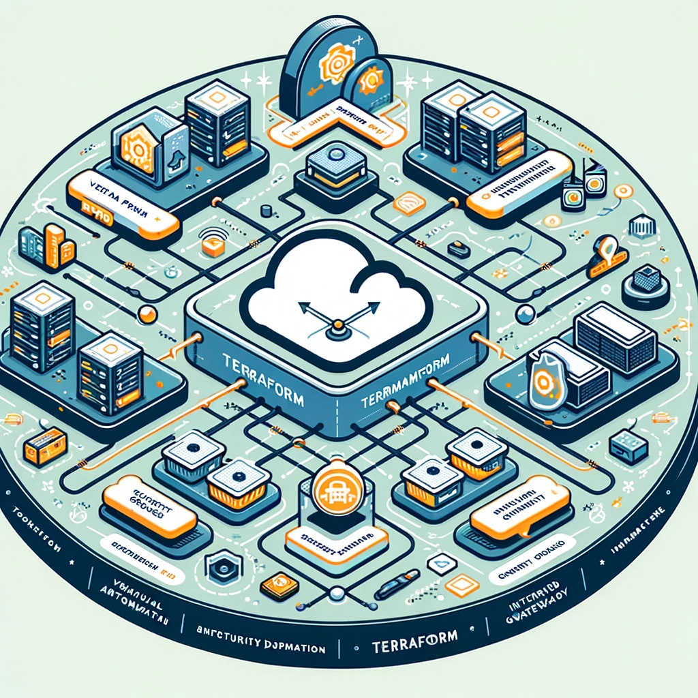

<h1 align="center">AWS Infrastructure Automation with Terraform 🚀</h1>

<p align="center">
  
</p>

## 📖 Project Overview

This project showcases the automation of secure, scalable cloud infrastructure on AWS using Terraform:

- ⌨️ **AWS Provider** - [Documentation](https://registry.terraform.io/providers/hashicorp/aws/latest/docs)
- ⌨️ **Aws Subnet** - [Documentation](https://registry.terraform.io/providers/hashicorp/aws/latest/docs/resources/subnet)
- ⌨️ **An IGW (Internet Gateway)** - [Documentation](https://registry.terraform.io/providers/hashicorp/aws/latest/docs/resources/internet_gateway)
- ⌨️ **A Route Table and Route Table Association** - [Documentation](https://registry.terraform.io/providers/hashicorp/aws/latest/docs/resources/route_table_association)
- ⌨️ **A Security Group** - [Documentation](https://registry.terraform.io/providers/hashicorp/aws/latest/docs/resources/security_group)
- ⌨️ **An AMI Datasource** - [Documentation](https://registry.terraform.io/providers/hashicorp/aws/3.74.2/docs/data-sources/ami)
- ⌨️ **An EC2 Instance** - [Documentation](https://registry.terraform.io/providers/hashicorp/aws/latest/docs/resources/instance)
- ⌨️ **Userdata and the `file` Function** - [Documentation](https://registry.terraform.io/providers/serverscom/serverscom/latest/docs/guides/user-data)
- ⌨️ **SSH Config Scripts** - [Documentation](https://registry.terraform.io/providers/loafoe/ssh/latest/docs/resources/resources)
- ⌨️ **The `provisioner` and `templatefile`** - [Documentation](https://registry.terraform.io/providers/hashicorp/template/latest/docs/data-sources/file)
- ⌨️ **Variables** - [Documentation](https://developer.hashicorp.com/terraform/language/values/variables)
- ⌨️ **Conditional Expressions** - [Documentation](https://developer.hashicorp.com/terraform/language/expressions/conditionals)
- ⌨️ **Outputs** - [Documentation](https://developer.hashicorp.com/terraform/language/values/outputs)
 

## 🎯 Objectives

- **Automate the Mundane**: Deploy a robust AWS environment with minimal manual intervention.
- **Security**: A custom VPC and strict Security Groups ensure that resources remain secure.
- **Scalability in Mind**: Designed for easy scaling, making your infrastructure grow as your needs do.

## 🛠 Technologies Used

- **Terraform**: The spine of our infrastructure automation.
- **AWS**: featuring services like EC2, VPC, and subnets etc.

<!-- ## 📐 Architecture Diagram

<p align="center">
  
</p> -->

_Interconnected world of AWS resources created and managed by Terraform._

## 🚀 Getting Started

### Prerequisites

Ensure you're equipped with:
- Terraform (`≥ v1.7.0`)
- AWS CLI, all set up and ready to go

### 🌟 Spinning Up the Universe

```bash
# Clone the cosmic repository
git clone https://github.com/ConniceT/InInfracode-AWS-Terraform.git

# Initialize Terraform in the project directory
terraform init

# Plan your deployment strategy
terraform plan

# Deploy your infrastructure to the AWS 
terraform apply
